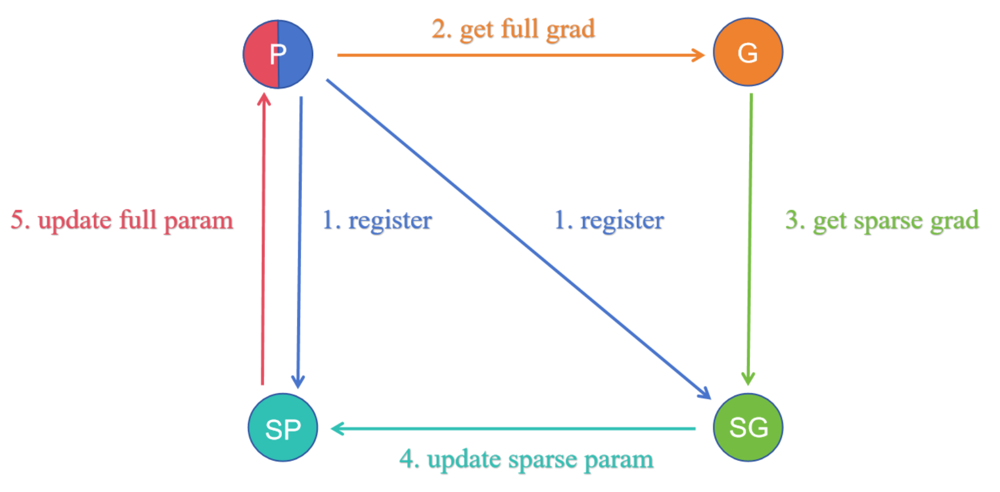
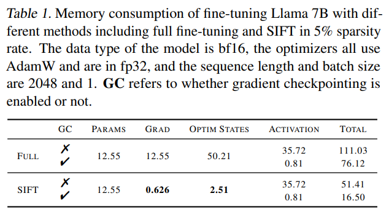
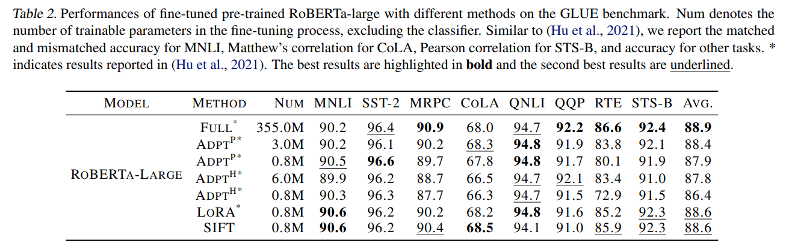
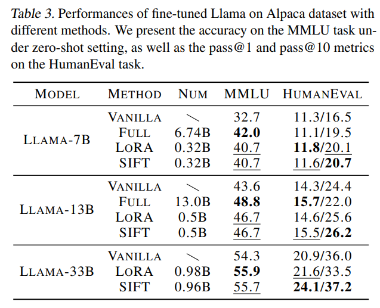
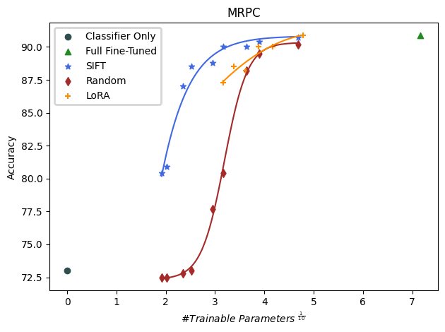

# SIFT: Sparse Increment Fine-Tuning
This is the repository of the paper: \
[**Sparse is Enough in Fine-tuning Pre-trained Large Language Model**](https://arxiv.org/abs/2312.11875)\
*Weixi Song\*, Zuchao Li\*, Lefei Zhang, Hai Zhao, Bo Du*

## Contents
- [Introduction](#Introduction)
- [Install](#Intall)
- [Usage](#Usage)
- [Citation](#Citation)

## Introduction
 

<div align=center>
  
</div>

In this work, we present a compoent-sparse and memory-efficient updating scheme (SIFT). Inspired by the memory-efficient SGD implementation in [LOMO](https://github.com/OpenLMLab/LOMO), we implement a component-sparse updating scheme(SIFT) by injecting hook in the backward propagation. See [our paper](https://arxiv.org/abs/2312.11875) for more details. The main code of SIFT is in [sift.py](./sift/sift.py)

Through this method, for x% sparse updates, we can simultaneously reduce the gradients and optimizer states to the original x%. Combined with techniques such as mixed-precision training and gradient checkpointing, it is able to fine-tune a 7B model on a single RTX 3090 24GB.

<div align=center>
  
</div>

We provide several use cases in Natural Language Processing and it can be applied to different areas in the same way. See [exp](./exp/) for experiments in GLUE benchmark and the Instruction-tuning task. The experiments are built on the orginal repositories of [Transformers](https://github.com/huggingface/transformers/tree/main/examples/pytorch/text-classification), [Alpaca](https://github.com/tatsu-lab/stanford_alpaca) and [MMLU](https://github.com/hendrycks/test). HumanEval Evaluation is conducted in [code-eval](https://github.com/abacaj/code-eval). Thanks for these great works.
<div align=center>
  
</div>
<div align=center>
  
</div>


## Install
```bash
git clone git@github.com:song-wx/SIFT.git
cd SIFT
pip install .
```
Please solve the dependency issues as needed.
## Usage

Note: The current implementation only considers training in a single card. If you are interested in training in multiple cards, please modify the code to fit your demand.

### Basic usage

Step 1: After initializing your model, run the following code to specify the parameters that need to be updated sparsely by setting `sparse_module` and `sparse_rate` to customize the sparse training and also you can specify the module to be updated normally by setting `exception`. 
```python
## initialize your model
model = ...

## initialize SIFT 
from sift import SIFT

sift = SIFT(model, sparse_rate=0.01, 
            sparse_module=['q_proj', 'k_proj', 'v_proj', 'o_proj', 'down_proj', 'gate_proj', 'up_proj'],
            grad_acc=gradient_accumulation,
            gradient_checkpointing=gradient_checkpointing)

## you can print the actual trainable numbers in SIFT
sift.print_trainable_parameters()
```

Step 2: Initialize the optimizer with the actual trainable parameters `sift.named_parameters_in_optimizer()` in SIFT.
```python
## example
no_decay = ["bias", "LayerNorm.weight"]
optimizer_grouped_parameters = [
            {
                "params": [p for n, p in sift.named_parameters_in_optimizer() if not any(nd in n for nd in no_decay) ] ,
                "weight_decay": weight_decay,
            },
            {
                "params": [p for n, p in sift.named_parameters_in_optimizer() if any(nd in n for nd in no_decay) ] ,
                "weight_decay": 0.0,
            },   
        ]
    
optimizer = torch.optim.AdamW(optimizer_grouped_parameters, lr=learning_rate)
```
Step 3: run the training loop normally with `model` and `optimizer`
```python
## if use Trainer
trainer = Trainer(model=model, optimizer=(optimizer, None), ...)
trainer.train()

## if use bare training loop, it is the same as the normal training process.
for i, batch in enumerate(dataloader):
    output = model(**batch)
    loss = ...
    loss.backward()
    optimizer.step()
    optimizer.zero_()
```
### Customized usage

SIFT essentially creates an additional sparse parameter`sparse_param` for each parameter`p` that needs to be sparsely updated, which is represented in the indexes `sparse_param.idx` and the values `sparse_param.data`. After initializing SIFT, you can get the sparse parameter `sparse_param` of a target parameter `p` with the name `n` by using the dict `sift.sparse_mapping[n]`. 

#### Customize the selection of indexes
In [our paper](https://arxiv.org/abs/2312.11875), we propose a gradient-based selection method based on our finding of the quasi-sparse gradient distribution of the pre-trainde model. We determine the indexes as the components whose absolute gradient of the first few batches are in the top x%.
```python
sparse_idx = torch.flatten(abs(grad)).topk(sparse_param.train_num).indices.cpu().numpy() 
sparse_param.idx = np.stack(np.unravel_index(sparse_idx, p.shape))
```
We compare the efficiency of this gradient-based method with [LoRA](https://arxiv.org/abs/2106.09685) and random selection in different quotas of the trainable parameters. You can modify the above codes in [sift.py](./sift/sift.py) to customize your index selection.
<div align=center>
  
</div>


#### Store in a memory-effient way
Due to SIFT merging `sparse_param` into the original `p` in the hook to ensure the correct forward propagation(as the following codes), the final updated parameters are the original parameters `p`. If you want to store in a memory-effient way, you can store the partial components of `p` with  `sparse_param.idx` otherwise we save the complete `p`.
```python
## update the initial param sparsely
delta = p.data + torch.sparse_coo_tensor(sparse_param.idx, sparse_param, p.shape).to(p)
p.data.copy_(delta)  
sparse_param.zero_()
```

## Citation

```Bibtex
@misc{song2023sparse,
      title={Sparse is Enough in Fine-tuning Pre-trained Large Language Model}, 
      author={Weixi Song and Zuchao Li and Lefei Zhang and Hai Zhao and Bo Du},
      year={2023},
      eprint={2312.11875},
      archivePrefix={arXiv},
      primaryClass={cs.LG}
}
```
